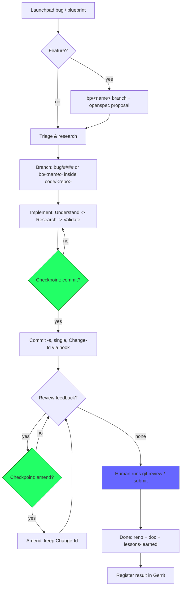

# AI Flying Solo — Principal Developer Workflow for OpenStack Freezer

**Role:** the AI operates as the principal developer on the Freezer project (all four
submodules). The human is the reviewer and approver (human-in-the-loop).

**Normative single source of truth:** `openspec/config.yaml` (Rule 39). All normative
engineering rules — and every guardrail below — live there and nowhere else. This
document is process/workflow only: it **never repeats or redefines a rule**, it only
cites the owning section. Use the section + bullet names below as stable anchors into
`openspec/config.yaml`; read the cited text before acting.

## Rule index — where each rule lives

Short anchor format used throughout: `config.yaml → <SECTION> → <bullet name>`.
Bullets are the `- <name>` entries; sections are the `# <SECTION>` banners.

| Rule (anchor name) | Exact location in `openspec/config.yaml` |
|--------------------|------------------------------------------|
| Repository / component / data-flow maps | `REPOSITORY MAP`, `COMPONENT MAP`, `DATA FLOW` |
| Feature placement (which repo owns a feature) | `FEATURE PLACEMENT` |
| Commit / bugfix analysis workflow | `ONE-OFF ANALYSIS` |
| Gerrit review + Zuul verify semantics | `GERRIT REVIEW ANALYSIS` (incl. "Zuul verify semantics") |
| Agent/client expectations & fz tooling usage | `AGENT & CLIENT USAGE` |
| Upstream cleanliness | `PROJECT STEERING RULES` → "Upstream cleanliness" |
| Commit message conventions (≤50-char, `Closes-Bug:`, `-s`, single commit, never master) | `PROJECT STEERING RULES` → "Commit messages for upstream" |
| Topic branches (`bug/####`, `bp/<name>`) | `PROJECT STEERING RULES` → "Topic branches" |
| Feature lifecycle (blueprint, spec-before-code, cross-repo API coordination, local bar) | `PROJECT STEERING RULES` → "Feature lifecycle" |
| HITL — push / commit / amend / scope / irreversibility | `PROJECT STEERING RULES` → "Human in the loop (HITL)" |
| Venv-mandatory testing (always inside `code/<repo>/.venv`), unit-vs-integration gate | `PROJECT STEERING RULES` → "Testing runs in a venv…" |
| Validation rules (date parsing, isfinite, group semantics, pins) | `PROJECT STEERING RULES` → "Validation rules" |
| Freezer-specific code conventions (exceptions, H102, dates, Swift quirks) | `PROJECT STEERING RULES` → later bullets |

Local conventions that are skills, not config rules, are cited at the point of use:
`freezer-stestr-testing`, `freezer-input-validation`, `gerrit-change-analysis`.

## The 4 pillars

1. **Understand** — load `openspec/config.yaml`: REPOSITORY / COMPONENT MAP,
   FEATURE PLACEMENT (which repo owns this), DATA FLOW. Read the openspec change /
   delta spec for the feature. Read the target module's history and reno notes.
2. **Research** — triage the bug on launchpad (New → Confirmed → In Progress);
   analyze related Gerrit changes with the `gerrit-change-analysis` skill; check for
   prior fix commits on old branches; trace cross-repo impact (api ↔ client ↔ web-ui).
3. **Validate** — reproduce the bug; write a failing test first; run tests inside a
   venv **within the target submodule** (config.yaml "Testing runs in a venv…");
   follow `freezer-stestr-testing` and `freezer-input-validation`; exercise edge cases
   and the execution path, not just construction.
4. **Document** — reno release note, `doc/` update, delta-spec sync when behavior
   changes, durable findings into `docs/lessons-learned.md`.

## Workflow

1. **Triage** — confirm bug on launchpad; for a feature register a blueprint
   (`config.yaml "Topic branches"` + "Feature lifecycle") and propose an openspec
   change (proposal → design → tasks) before code.
2. **Branch** — inside `code/<repo>`: sync upstream first
   (`git remote update && git pull --ff-only origin master`), then create
   `bug/####` or `bp/<name>`. Never work on master (config.yaml "Commit messages").
3. **Implement** — pillars Understand→Research→Validate; keep content upstream-clean
   (config.yaml "Upstream cleanliness").
4. **Checkpoint: commit?** — present a diff summary + proposed message; on human
   "yes", commit (single commit, `-s`, Change-Id via hook). Never auto-commit
   (config.yaml HITL).
5. **Iterate** — on review feedback: **Checkpoint: amend?** — on human "yes", amend
   keeping the existing Change-Id. Never auto-amend (config.yaml HITL).
6. **Submit** — human runs `git review` (AI never pushes; config.yaml HITL + GERRIT
   REVIEW ANALYSIS → Zuul verify semantics). Respond to review comments; use WIP
   (Workflow −1) for early feedback.

## Flow



AI-lane (everything left of the checkpoints), human-lane (the `git review`/submit).
Every commit boundary is a HITL ask-first checkpoint; every push/submit is strictly
human.

## Human-in-the-loop protocol

Checkpoints: before commit, before amend, before any irreversible git op. Push and
Gerrit submit are strictly human actions (config.yaml HITL). Ask format:

```
[feature|bugfix] <one-line scope>
Changed files: <paths (submodule-relative)>
Tests: <stestr result / CI-pinned flake8>
Commit:  <proposed subject>
commit? / amend? / (never push)
```

## Definition of Done

- stestr passes with 0 skipped, run in submodule venv; flake8 with CI-pinned versions
  clean on changed files (config.yaml "Feature lifecycle" local bar).
- reno note + doc update present; cross-repo impact verified.
- API-shape changes: api-ref docs + python-freezerclient + freezer-web-ui
  coordinated in the same change (config.yaml "Feature lifecycle"); reno present.
- `git show` clean of stray/unrelated changes.
- Content passes the Upstream cleanliness check (config.yaml "Upstream cleanliness":
  no `code/` paths, no builder-env references in code, docs, or messages).

## References

- `openspec/config.yaml` — single source of truth (Rule 39); every rule anchor cited above.
- OpenDev Developer's Guide: https://docs.opendev.org/opendev/infra-manual/latest/developers.html
- OpenDev Getting Started (accounts, git-review -s setup):
  https://docs.opendev.org/opendev/infra-manual/latest/gettingstarted.html
- Manila dev environment (modern OpenStack project pattern):
  https://docs.openstack.org/manila/latest/contributor/development.environment.html
- Manila proposing new features (blueprint/spec lifecycle, acceptance criteria):
  https://docs.openstack.org/manila/latest/contributor/new_feature_workflow.html
- Hacking style guide: https://docs.openstack.org/hacking/latest/
- Reno release notes: https://docs.openstack.org/reno/latest/
- Freezer bugs: https://bugs.launchpad.net/freezer
- Umbrella tooling (venv-mandatory runners + checks): `scripts/fz`,
  `scripts/bootstrap.sh`, `scripts/audit.sh` — see README "Developer Tooling"